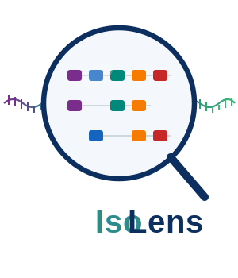
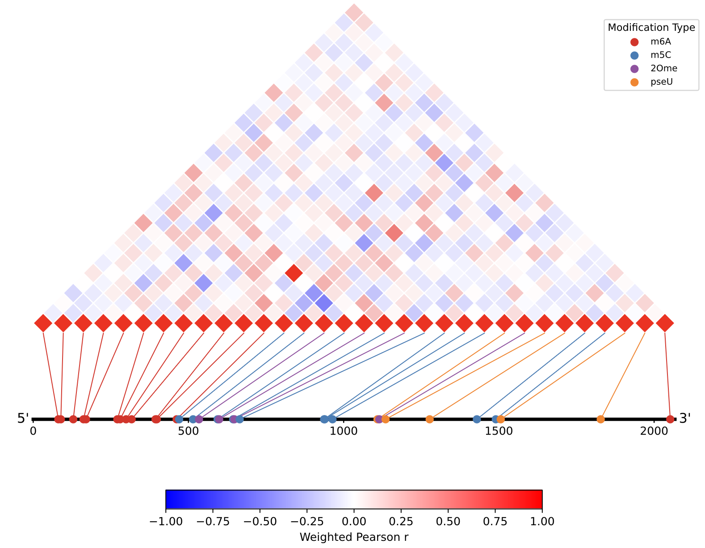

<p align="center">
  
</p>

<p align="center">
  <strong>Isoform-aware RNA modification and poly(A) tail analysis for direct RNA sequencing data.</strong>
</p>

# IsoLens

[](https://pypi.org/project/isolens/)
[](https://pypi.org/project/isolens/)
[](LICENSE)
[](https://github.com/gxelab/isolens/actions/workflows/ci.yml)
[](https://pypistats.org/packages/isolens)


**IsoLens** is a Python toolkit for isoform-aware analysis of RNA modifications and poly(A) tail lengths from Oxford Nanopore direct RNA sequencing data, explicitly accounting for transcript assignment uncertainty to enable accurate transcript-level profiling.

---

## Why IsoLens?

Most long-read RNA analysis tools either analyze RNA modifications or poly(A) tails **without discrimination of transcript isoforms** or **only use reads uniquely mappp to a single isoform**. IsoLens propagates transcript assignment probabilities from [Oarfish](https://github.com/COMBINE-lab/oarfish) throughout both modification and poly(A) analyses, enabling more accurate transcript-level estimates for genes with complex isoform structure.

Key capabilities:

- Efficient HDF5 and Parquet outputs for large-scale studies
- Isoform-aware RNA modification profiling at single-nucleotide resolution
- Modification site co-occurrence and correlation analysis
- Differential modification testing between conditions, isoforms, and genes
- Gene-level aggregation of modification sites across isoforms
- Transcript-level poly(A) tail length estimation with uncertainty propagation
- Differential poly(A) testing between conditions and isoforms
- Gene-level aggregation of transcript-level modification and poly(A) data
- Detection of bimodal distribution of poly(A) tail lengths

---

## Quick Start

Install:

```bash
pip install isolens
```

IsoLens requires sorted transcriptome alignments and Oarfish read assignment probabilities as input:
```bash
# index transcriptome
minimap2 -x map-ont -d transcriptome.mmi transcriptome.fa.gz

# mapping (minimap2/rammap)
samtools fastq -T MM,ML,pt reads.bam \
    | minimap2 --eqx -N 100 -ax map-ont -y -t8 transcriptome.mmi - \
    | samtools view -@8 -b -o alignments.bam

# run oarfish
oarfish -j 16 -a alignments.bam -o oarfish_out --filter-group no-filters \
    --model-coverage --write-assignment-probs=compressed

# sort and index alignments
samtools sort -@ 8 -o alignments.sorted.bam alignments.bam
samtools index alignments.sorted.bam
```

Build transcript-level modification matrices:

```bash
isolens mod_scan -b alignments.sorted.bam -a oarfish_out.prob.lz4 -o mod_scan.h5
```

Summarize modification sites per transcript:

```bash
isolens mod_sites -i mod_scan.h5 -o sites.parquet
```

Estimate transcript-level poly(A) lengths:

```bash
isolens polya_calc -a oarfish_out.prob.lz4 -b reads.bam -o polya.tsv.gz -z
```

> **Note:** The legacy `python -m isolens.<module>` invocation style continues to work for backward compatibility.

---

## Contents

- [Pipeline Overview](#pipeline-overview)
- [Installation](#installation)
- [Modules](#modules)
- [Python API](#python-api)
- [Input Data Requirements](#input-data-requirements)
- [Development](#development)
- [Example Data](#example-data)
- [License](#license)

---

## Pipeline Overview

```
Oarfish assignment ──┐
                      ├── mod_scan (HDF5) ──┬── mod_sites ──► transcript-level site summary (.parquet/.tsv)
    BAM (alignment) ─┘       │                     │
                             │                     ├─► mod_gene ──► gene-level site summary (.parquet/.tsv)
                             │                     │
                             │                     │      └── mod_dmcg ──► gene-level differential
                             │                     │                       modification across conditions
                             │                     │
                             │─────────────────────├─► mod_corr ──► intra-transcript site correlations (.parquet/.tsv)
                             │                     │                + PDF heatmaps (-d)
                             │                     │
                             │─────────────────────├─► mod_dmc ───► differential modification
                             │                     │                across conditions
                             │                     │
                             │─────────────────────├─► mod_dmt ───► differential modification
                                                                    across isoforms of the same gene

Oarfish assignment ────┐ 
                        ├── polya_calc (.parquet/.tsv) ──┬─► polya_merge ───► pool replicates (.tsv/.parquet)
BAM (reads/alignment) ─┘                                 ├─► polya_dpc ───► condition diff (.tsv/.parquet)
                                                         ├─► polya_dpt ───► isoform diff (.tsv/.parquet)
                                                         ├─► polya_gene ───► gene-level (.tsv/.parquet)
                                                         └─► polya_bimodal ─► bimodality calls (.tsv/.parquet)
```

### Outputs

| Command | Output |
|----------|----------|
| `mod_scan` | HDF5 read × transcript position modification matrices |
| `mod_sites` | Transcript-level per-site modification summaries |
| `mod_gene` | Gene-level per-site modification summaries |
| `mod_corr` | Pairwise modification site correlations within the same transcript |
| `mod_dmc` | Transcript-level differentially modified sites between conditions) |
| `mod_dmt` | Differential modification of sites between isoforms |
| `mod_dmcg` | Gene-level differentially modified sites between conditions |
| `polya_calc` | Transcript-level poly(A) estimates |
| `polya_merge` | Merged replicate poly(A) estimates |
| `polya_dpc` | Genome-wide differential poly(A) between conditions |
| `polya_dpt` | Pairwise differential poly(A) between isoforms |
| `polya_gene` | Gene-level poly(A) summaries |
| `polya_bimodal` | Transcript-level bimodal poly(A) tail length detection |

---

## Installation

```bash
pip install isolens
```

---

## Modules

### `mod_scan` — HDF5 read × position matrices

Generates a single HDF5 file containing transcript-specific read-by-position modification matrices. For each transcript, IsoLens constructs an `(n_reads × transcript_length)` `uint8` matrix that encodes the nucleotide state at every position for every aligned read. Nucleotide states are parsed using logic consistent with that implemented in [modkit](https://github.com/nanoporetech/modkit), ensuring compatibility with standard Oxford Nanopore modification annotations.

**Encoding:** 0 = uncovered, 1 = canonical match, 2 = mismatch, 3 = deletion, 4+ = tracked modification types, 254 = untracked modification, 255 = failed (all states below probability threshold).

```bash
isolens mod_scan \
  -b alignments.bam \
  -a oarfish.lz4 \
  -o mod_scan.h5 \
  -c 0.95 \
  -t 4 -v
```

Key options:

| Flag | Description | Default |
|------|-------------|---------|
| `-b, --bam` | Transcriptome BAM alignment | (required) |
| `-a, --oarfish` | Oarfish assignment probability file (`.lz4` or plain text) | (required) |
| `-o, --output` | Output HDF5 path | (required) |
| `-c, --mod-cutoff` | Modification probability threshold | 0.95 |
| `-m, --mod-type` | Modification types to scan for (SAM code suffixes) | `a,m,17596,17802,19228,69426,19229,19227` |
| `-p, --min-asp` | Minimum assignment probability filter | 0.0 |
| `-d, --max-depth` | Max reads per transcript | 5000 |
| `-t, --threads` | Worker threads for parallel processing | 2 |
| `-v, --verbose` | Print progress to stderr | off |

**HDF5 structure:** `/transcripts/<tx_name>/matrix` (uint8), `read_ids` (string), `read_weights` (float32); `/modification_codes` (attrs); `/metadata` (attrs).

---

### `mod_sites` — Per-position modification summaries

Reads the HDF5 output generated by `mod_scan` and summarizes modification information into a Parquet or TSV file, with one row per `(transcript, position, modification_type)`. For each site, IsoLens reports modification levels, read coverage, and modification counts, while tracking mismatches, deletions, other-modifications, and failed calls as separate categories.

When the same modification probability threshold is used (`--mod-cutoff` in `mod_scan` and `--filter-threshold` in modkit), the combination of `mod_scan` and `mod_sites` produces unweighted modification counts that match those generated by `modkit pileup`.

Multiple HDF5 files can be provided — reads for the same transcript are pooled across all files before computing statistics.

```bash
isolens mod_sites \
  -i mod_scan.h5 \
  -o sites.parquet

# With genomic coordinate mapping
isolens mod_sites \
  -i mod_scan.h5 \
  -o sites.parquet \
  -g annotations.gtf
```

Key options:

| Flag | Description | Default |
|------|-------------|---------|
| `-i, --h5` | Input HDF5 file(s) from `mod_scan` (accepts multiple) | (required) |
| `-o, --output` | Output file | (required) |
| `-f, --format` | Output format: `parquet` or `tsv` | `parquet` |
| `-z, --gzip` | Gzip-compress TSV output | off |
| `-s, --sites` | Predefined modification sites TSV (`tx_name`, `posn`) | all sites |
| `-p, --min-asp` | Minimum assignment probability filter | 0.0 |
| `-t, --threads` | Worker threads for parallel processing | `min(4, cpu_count)` |
| `-x, --transcripts` | Only process specified transcript IDs | all |
| `-g, --gtf` | GTF annotation for genomic coordinate mapping | off |
| `-v, --verbose` | Print progress | off |

**Output columns (23):** `transcript_id`, `position`, `mod_type`, `n_modified`, `wt_modified`, `n_unmodified`, `wt_unmodified`, `n_canonical`, `wt_canonical`, `n_othermod`, `wt_othermod`, `n_mismatch`, `wt_mismatch`, `n_deletion`, `wt_deletion`, `n_failed`, `wt_failed`, `mod_level`, `wt_mod_level`, `gene_id`\*, `chrom`\*, `strand`\*, `gpos`\* (\*requires `--gtf`).

---

### `mod_corr` — Pairwise modification site correlation

Identifies cooperative or antagonistic relationships between modification sites within the same transcript. Computes both within-type and cross-type correlations using weighted 2×2 contingency tables. Multiple HDF5 files can be provided — reads for the same transcript are pooled across all files.

**Metrics:** Phi coefficient (Pearson's r for binary variables), odds ratio with Haldane-Anscombe correction, p-value via t-distribution, Benjamini-Hochberg FDR q-value (per-transcript), and mutual information. Both unweighted and assignment-probability-weighted variants are computed for every metric.

```bash
isolens mod_corr \
  -i mod_scan.h5 \
  -s sites.parquet \
  -o correlations.parquet \
  -m 10 -l 0.05 -c 10
```

Key options:

| Flag | Description | Default |
|------|-------------|---------|
| `-i, --h5` | Input HDF5 file(s) from `mod_scan` (accepts multiple) | (required) |
| `-s, --sites` | Site summary from `mod_sites` (Parquet or TSV/TSV.GZ) | (required) |
| `-o, --output` | Output file | (required) |
| `-m, --min-mod-reads` | Minimum `n_modified` for a site to be considered | 2 |
| `-l, --min-mod-level` | Minimum `mod_level` for a site to be considered | 0.05 |
| `-c, --min-coverage` | Minimum total depth for a site to be considered | 10 |
| `-p, --min-asp` | Minimum assignment probability filter | 0.0 |
| `-f, --format` | Output format: `parquet` or `tsv` | `parquet` |
| `-z, --gzip` | Gzip-compress TSV output | off |
| `-d, --plot-dir` | Generate pyramid heatmap PDFs per transcript in this directory | off |
| `-t, --metric` | Statistic to visualize in heatmaps (`corr`, `wcorr`, `mi`, `wmi`, `or`, `wor`) | `wcorr` |
| `-x, --transcripts` | Only process specified transcript IDs | all |
| `-v, --verbose` | Print progress | off |

**Output columns (25):** `transcript_id`, `site1`, `site2`, `mod_type1`, `mod_type2`, `wt_mod_level1`, `wt_mod_level2`, `n11`, `n10`, `n01`, `n00` (2×2 contingency counts), `w11`, `w10`, `w01`, `w00` (weighted), `corr`, `pvalue`, `qvalue` (unweighted Pearson + BH FDR), `wcorr`, `wpvalue`, `wqvalue` (weighted Pearson + BH FDR), `mi`, `wmi` (mutual information), `or`, `wor` (log2 odds ratio).

When `-d` is used, generates rotated triangular heatmap PDFs per transcript showing the correlation matrix and site positions along the transcript body.

<p align="center">
  
</p>

---

### `mod_gene` — Gene-level modification aggregation

Aggregates transcript-level modification site summaries to the gene level by summing per-position counts grouped by `(gene_id, chrom, strand, gpos, mod_type)`. Requires the site summary to have been generated with `--gtf` so that genomic coordinate columns are present.

```bash
isolens mod_gene \
  -i sites.parquet \
  -o gene_sites.parquet
```

Key options:

| Flag | Description | Default |
|------|-------------|---------|
| `-i, --input` | Site summary from `mod_sites` (must have GTF columns) | (required) |
| `-o, --output` | Output file | (required) |
| `-f, --format` | Output format: `parquet` or `tsv` | `parquet` |
| `-z, --gzip` | Gzip-compress TSV output | off |
| `-v, --verbose` | Print progress | off |

**Output columns:** `gene_id`, `chrom`, `strand`, `gpos`, `mod_type`, and all per-position count/weight columns summed across transcripts. `mod_level` and `wt_mod_level` are recomputed from the summed counts.

---

### `mod_dmc` — Differential modification between conditions

Compares modification levels between two experimental conditions at each `(transcript, position, mod_type)` site using read-level weighted logistic regression. Reads from multiple HDF5 files are pooled within each condition before testing.

```bash
isolens mod_dmc \
  -i1 cond1_rep1.h5 -i1 cond1_rep2.h5 \
  -i2 cond2_rep1.h5 -i2 cond2_rep2.h5 \
  -s1 cond1_sites.parquet \
  -s2 cond2_sites.parquet \
  -o dmc_results.parquet -v
```

Key options:

| Flag | Description | Default |
|------|-------------|---------|
| `-i1, --h5-1` | HDF5 file(s) for condition 1 (repeatable) | (required) |
| `-i2, --h5-2` | HDF5 file(s) for condition 2 (repeatable) | (required) |
| `-s1, --sites-1` | Site summary for condition 1 | (required) |
| `-s2, --sites-2` | Site summary for condition 2 | (required) |
| `-o, --output` | Output file | (required) |
| `-f, --format` | Output format: `parquet` or `tsv` | `parquet` |
| `-z, --gzip` | Gzip-compress TSV output | off |
| `-p, --min-asp` | Minimum assignment probability filter | 0.0 |
| `-x, --transcripts` | Only process specified transcript IDs | all |
| `-v, --verbose` | Print progress | off |

**Output columns (24):** `transcript_id`, `position`, `mod_type`, `gene_id`, `chrom`, `strand`, `gpos`, `n_modified_1`, `n_unmodified_1`, `n_modified_2`, `n_unmodified_2`, `wt_modified_1`, `wt_unmodified_1`, `wt_modified_2`, `wt_unmodified_2`, `mod_level_1`, `mod_level_2`, `wt_mod_level_1`, `wt_mod_level_2`, `delta_mod_level`, `delta_wt_mod_level`, `log2_or`, `p_value`, `q_value` (BH FDR).

**Method:** Weighted logistic regression with Haldane-Anscombe correction for zero counts. Wald test p-values with global Benjamini-Hochberg FDR correction.

---

### `mod_dmt` — Differential modification between isoforms

Compares modification levels between transcript isoforms that share a genomic locus, using read-level weighted logistic regression. Transcripts are grouped by `(gene_id, chrom, gpos, strand, mod_type)` and all isoform pairs within each group are tested.

```bash
isolens mod_dmt \
  -i pooled.h5 \
  -s sites_with_gtf.parquet \
  -o dmt_results.parquet -v
```

Key options:

| Flag | Description | Default |
|------|-------------|---------|
| `-i, --h5` | Input HDF5 file(s) from `mod_scan` | (required) |
| `-s, --sites` | Site summary from `mod_sites` (must have `--gtf` columns) | (required) |
| `-o, --output` | Output file | (required) |
| `-f, --format` | Output format: `parquet` or `tsv` | `parquet` |
| `-z, --gzip` | Gzip-compress TSV output | off |
| `-p, --min-asp` | Minimum assignment probability filter | 0.0 |
| `-x, --transcripts` | Only consider specified transcript IDs | all |
| `-v, --verbose` | Print progress | off |

**Output columns (26):** `gene_id`, `chrom`, `gpos`, `strand`, `mod_type`, `transcript_id_1`, `transcript_id_2`, `position_1`, `position_2`, `mod_level_1`, `mod_level_2`, `wt_mod_level_1`, `wt_mod_level_2`, `delta_mod_level`, `delta_wt_mod_level`, `n_modified_1`, `n_unmodified_1`, `n_modified_2`, `n_unmodified_2`, `wt_modified_1`, `wt_unmodified_1`, `wt_modified_2`, `wt_unmodified_2`, `log2_or`, `p_value`, `q_value` (BH FDR).

**Method:** Same weighted logistic regression backend as `mod_dmc`. Transcripts are pre-loaded from HDF5 for efficient paired testing. Global BH FDR correction.

---

### `mod_dmcg` — Gene-level differential modification

Compares modification levels between two conditions at the gene level using Fisher's exact test. Takes gene-level site summaries from `mod_gene` as input — no HDF5 or read-level data required.

```bash
isolens mod_dmcg \
  -s1 cond1_genes.parquet \
  -s2 cond2_genes.parquet \
  -o dmcg_results.parquet -v
```

Key options:

| Flag | Description | Default |
|------|-------------|---------|
| `-s1, --sites-1` | Gene-level summary for condition 1 (from `mod_gene`) | (required) |
| `-s2, --sites-2` | Gene-level summary for condition 2 (from `mod_gene`) | (required) |
| `-o, --output` | Output file | (required) |
| `-f, --format` | Output format: `parquet` or `tsv` | `parquet` |
| `-z, --gzip` | Gzip-compress TSV output | off |
| `-v, --verbose` | Print progress | off |

**Output columns (25):** `gene_id`, `chrom`, `strand`, `gpos`, `mod_type`, `n_modified_1`, `n_unmodified_1`, `n_modified_2`, `n_unmodified_2`, `wt_modified_1`, `wt_unmodified_1`, `wt_modified_2`, `wt_unmodified_2`, `mod_level_1`, `mod_level_2`, `wt_mod_level_1`, `wt_mod_level_2`, `delta_mod_level`, `delta_wt_mod_level`, `log2_or`, `p_value`, `q_value` (unweighted Fisher + BH FDR), `w_log2_or`, `w_p_value`, `w_q_value` (weighted Fisher with rounded counts + BH FDR).

**Method:** Two Fisher's exact tests per matched gene-position — one on raw integer counts, one on `wt_modified` / `wt_unmodified` rounded to the nearest integer. Global BH FDR correction applied separately to each set of p-values.

---

### `polya_calc` — Poly(A) tail length estimation

Extracts poly(A) tail lengths from Dorado's `pt:i` BAM tags, weighted by Oarfish assignment probabilities.

```bash
isolens polya_calc \
  -a oarfish.lz4 \
  -b reads.bam \
  -o polya.tsv.gz -z
```

Key options:

| Flag | Description | Default |
|------|-------------|---------|
| `-a, --oarfish` | Oarfish assignment probability file (`.lz4` or plain text) | (required) |
| `-b, --bam` | BAM file with `pt:i` poly(A) tags (from Dorado) | (required) |
| `-o, --output` | Output file | (required) |
| `-f, --format` | Output format: `parquet` or `tsv` | `tsv` |
| `-z, --gzip` | Gzip-compress TSV output | off |
| `-g, --gtf` | GTF annotation for transcript-to-gene mapping (adds `gene_id` column) | off |
| `-p, --min-asp` | Minimum assignment probability filter | 0.0 |
| `-l, --log` | Log-transform lengths to compute weighted geometric mean | off |

**Output columns (6):** `transcript_id`, `n_reads`, `total_wt` (sum of assignment probabilities), `wmlen` (weighted mean poly(A) length), `weights` (comma-separated assignment probabilities), `lengths` (comma-separated raw poly(A) lengths). When `--gtf` is provided, `gene_id` is added as the first column.

---

### `polya_merge` — Merge poly(A) replicates

Combines two poly(A) files from separate replicates, recomputing weighted average tail lengths from the pooled per-read data. Accepts TSV/TSV.GZ or Parquet input and preserves the `gene_id` column when present in both inputs.

```bash
isolens polya_merge \
  -i1 rep1.tsv.gz \
  -i2 rep2.tsv.gz \
  -o merged.tsv.gz -z
```

Key options:

| Flag | Description | Default |
|------|-------------|---------|
| `-i1, --input1` | First input file (TSV/TSV.GZ or Parquet) | (required) |
| `-i2, --input2` | Second input file (TSV/TSV.GZ or Parquet) | (required) |
| `-o, --output` | Output file | (required) |
| `-f, --format` | Output format: `parquet` or `tsv` | `tsv` |
| `-z, --gzip` | Gzip-compress TSV output | off |
| `-l, --log` | Log-transform lengths to compute weighted geometric mean | off |

**Output columns (6):** Same schema as `polya_calc` — `transcript_id`, `n_reads`, `total_wt`, `wmlen`, `weights`, `lengths`. When inputs contain a `gene_id` column, it is preserved as the first output column. Per-transcript probability and length lists from both files are concatenated before recalculating `wmlen`.

---

### `polya_dpc` — Genome-wide differential poly(A) by condition

Compares poly(A) length distributions between two experimental conditions at each shared feature (transcript or gene) using three weighted two-sample tests: Kolmogorov-Smirnov, Welch's t-test, and rank-sum (Mann-Whitney U). P-values are computed with Kish's effective sample size correction, and global Benjamini-Hochberg FDR correction is applied separately per test type.

Accepts both transcript-level (from `polya_calc`) and gene-level (from `polya_gene`) input in TSV/TSV.GZ or Parquet format; the feature ID column is auto-detected from the input header.

```bash
isolens polya_dpc \
  -c1 control.tsv.gz \
  -c2 treatment.tsv.gz \
  -o dpc.tsv.gz -z
```

Key options:

| Flag | Description | Default |
|------|-------------|---------|
| `-c1, --condition1` | Condition 1 file (TSV/TSV.GZ or Parquet) | (required) |
| `-c2, --condition2` | Condition 2 file (TSV/TSV.GZ or Parquet) | (required) |
| `-o, --output` | Output TSV file | (required) |
| `-f, --format` | Output format: `parquet` or `tsv` | `tsv` |
| `-z, --gzip` | Gzip-compress TSV output | off |
| `-p, --min-asp` | Minimum assignment probability threshold | 0.0 |
| `-n, --min-pareads` | Minimum reads with effective poly(A) length | 5 |
| `-l, --log` | Log-transform lengths for geometric means/medians and hypothesis tests on log-scale | off |

**Output columns (20):** `feature_id`, `n_reads_1`, `total_wt_1`, `wmlen_1`, `wmedlen_1`, `n_reads_2`, `total_wt_2`, `wmlen_2`, `wmedlen_2`, `ks_stat`, `ks_p_value`, `ks_q_value`, `wmlen_diff`, `t_stat`, `t_p_value`, `t_q_value`, `wmedlen_diff`, `u_stat`, `u_p_value`, `u_q_value`. The feature ID column header is `transcript_id` for transcript-level input, `gene_id` for gene-level input.

**Method:** Weighted KS test, weighted Welch's t-test, and weighted rank-sum test, each with Kish's effective sample size. Global BH FDR correction applied separately to each p-value column.

---

### `polya_dpt` — Pairwise differential poly(A) between isoforms

Compares poly(A) length distributions between all pairs of transcript isoforms within the same gene using the same three weighted two-sample tests as `polya_dpc`. Transcripts are grouped into genes using either a GTF annotation file (`-g`) or an existing `gene_id` column in the input.

```bash
isolens polya_dpt \
  -i polya.tsv.gz \
  -g annotation.gtf \
  -o dpt.tsv.gz -z
```

Key options:

| Flag | Description | Default |
|------|-------------|---------|
| `-i, --input` | Transcript-level poly(A) file (TSV/TSV.GZ or Parquet) | (required) |
| `-g, --gtf` | GTF annotation for transcript-to-gene mapping (gzipped or raw) | none |
| `-o, --output` | Output TSV file | (required) |
| `-f, --format` | Output format: `parquet` or `tsv` | `tsv` |
| `-z, --gzip` | Gzip-compress TSV output | off |
| `-p, --min-asp` | Minimum assignment probability threshold | 0.0 |
| `-n, --min-pareads` | Minimum reads with effective poly(A) length | 5 |
| `-l, --log` | Log-transform lengths for geometric means/medians and hypothesis tests on log-scale | off |

**Output columns (22):** `gene_id`, `transcript_1`, `transcript_2`, `n_reads_1`, `total_wt_1`, `wmlen_1`, `wmedlen_1`, `n_reads_2`, `total_wt_2`, `wmlen_2`, `wmedlen_2`, `ks_stat`, `ks_p_value`, `ks_q_value`, `wmlen_diff`, `t_stat`, `t_p_value`, `t_q_value`, `wmedlen_diff`, `u_stat`, `u_p_value`, `u_q_value`.

**Method:** Same weighted two-sample test backend as `polya_dpc`. All isoform pairs within each gene are tested. Global BH FDR correction applied separately per test type.

---

### `polya_gene` — Transcript-to-gene aggregation

Aggregates transcript-level poly(A) estimates to the gene level. If the input already contains a `gene_id` column (e.g. from `polya_calc -g`), it is used directly; otherwise a GTF annotation file must be provided via `-g/--gtf`. Per-transcript probability and length lists are pooled before recalculating the weighted average.

```bash
isolens polya_gene \
  -i polya.tsv.gz \
  -g annotation.gtf \
  -o gene_polya.tsv.gz -z
```

Key options:

| Flag | Description | Default |
|------|-------------|---------|
| `-i, --input` | Input transcript poly(A) file (TSV/TSV.GZ or Parquet) | (required) |
| `-g, --gtf` | GTF annotation for transcript-to-gene mapping (gzipped or raw). Not needed if input already has a `gene_id` column. | none |
| `-o, --output` | Output gene-level file | (required) |
| `-f, --format` | Output format: `parquet` or `tsv` | `tsv` |
| `-z, --gzip` | Gzip-compress TSV output | off |
| `-l, --log` | Log-transform lengths to compute weighted geometric mean | off |

**Output columns (6):** `gene_id`, `n_reads`, `total_wt` (sum of pooled weights), `wmlen` (recalculated weighted mean), `weights` (comma-separated pooled probabilities), `lengths` (comma-separated pooled lengths).

---

### `polya_bimodal` — Bimodal poly(A) tail length detection

Detects transcripts with bimodal poly(A) tail length distributions using a consensus of two independent methods applied to a variance-stabilising log-transform (`log(length + 1)`):

1. **Weighted 1-D Gaussian Mixture Model** — fits both 1-component and 2-component models via EM, then compares them via delta-BIC (ΔBIC > 10 is evidence for two modes).
2. **Weighted KDE peak detection** — counts density peaks via `scipy.signal.find_peaks` with a configurable prominence threshold.

A transcript is called bimodal only when **both** methods agree.

> **⚠️ Important:** `polya_bimodal` should be run on **transcript-level** input (from `polya_calc`). While gene-level input (from `polya_gene`) is technically accepted, the results are likely misleading — pooling reads across all isoforms of a gene ignores transcript-specific poly(A) length variation. Different isoforms of the same gene can have genuinely distinct poly(A) length distributions; aggregating them at the gene level can create artefactual bimodality or mask true bimodality present in individual isoforms.

```bash
isolens polya_bimodal \
  -i polya.tsv.gz \
  -o bimodal.tsv.gz -z
```

Key options:

| Flag | Description | Default |
|------|-------------|---------|
| `-i, --input` | Input poly(A) file from `polya_calc` or `polya_gene` (TSV/TSV.GZ or Parquet; transcript-level recommended) | (required) |
| `-o, --output` | Output bimodality results file | (required) |
| `-f, --format` | Output format: `parquet` or `tsv` | `tsv` |
| `-z, --gzip` | Gzip-compress TSV output | off |
| `-l, --min-length` | Drop reads with poly(A) length below this threshold | 0.0 |
| `-p, --min-asp` | Drop reads with assignment probability below this threshold | 0.1 |
| `-e, --min-ess` | Skip feature if effective sample size below this threshold | 30.0 |
| `-k, --kde-prominence` | Prominence threshold for KDE peak detection | 0.05 |

**Output columns (15):** `feature_id`, `id_type` (`transcript_id` or `gene_id`), `n_reads_raw`, `n_reads_filtered`, `total_wt_raw`, `total_wt_filtered`, `delta_bic`, `bic_k1`, `bic_k2`, `ll_k1`, `ll_k2`, `n_kde_peaks`, `bimodal_gmm`, `bimodal_kde`, `bimodal_call` (consensus: `True` only if both GMM and KDE agree).

---

## Python API

The core data structures and parsing functions are available for programmatic use:

```python
from isolens._parsing import parse_oarfish

tx_names, prob_map, name_to_id = parse_oarfish("assignments.lz4")

# tx_names: list[str]
# prob_map: dict[int, list[TargetAssignment]]
# name_to_id: dict[str, int]
```

---

## Input Data Requirements

| File | Source | Required tags / format |
|--------|--------|----------------------|
| Transcriptome BAM | minimap2 + Dorado | `MM`/`ML` (base modifications), `pt:i` (poly(A) tail length) |
| Oarfish assignments | Oarfish | Read-to-transcript probability map (`.lz4` compressed or plain text) |

The BAM should be coordinate-sorted and aligned to a transcriptome reference.

---

## Development

```bash
git clone https://github.com/gxelab/isolens.git
cd isolens
pip install -e ".[dev]"
```

Run without installing:

```bash
# Using the unified CLI
uv run python -m isolens mod_scan -b ... -a ... -o ...

# Or directly (legacy, still supported)
uv run python -m isolens.mod_scan -b ... -a ... -o ...
```

Run tests:

```bash
pytest
```

Lint and format:

```bash
ruff check src tests
ruff format src tests
```

---

## Example Data

The `examples/` directory contains a small test dataset (subset of two *Drosophila* transcripts) suitable for verifying changes.

```bash
isolens mod_scan \
  -b examples/example.txmap.bam \
  -a examples/example.lz4 \
  -o example.mod_scan.h5 \
  -c 0.95 -v

isolens mod_sites \
  -i example.mod_scan.h5 \
  -o example.sites.parquet

isolens polya_calc \
  -a examples/example.lz4 \
  -b examples/example.txmap.bam \
  -o example.polya.tsv.gz -z
```

---

## License

Distributed under the [MIT License](LICENSE).
